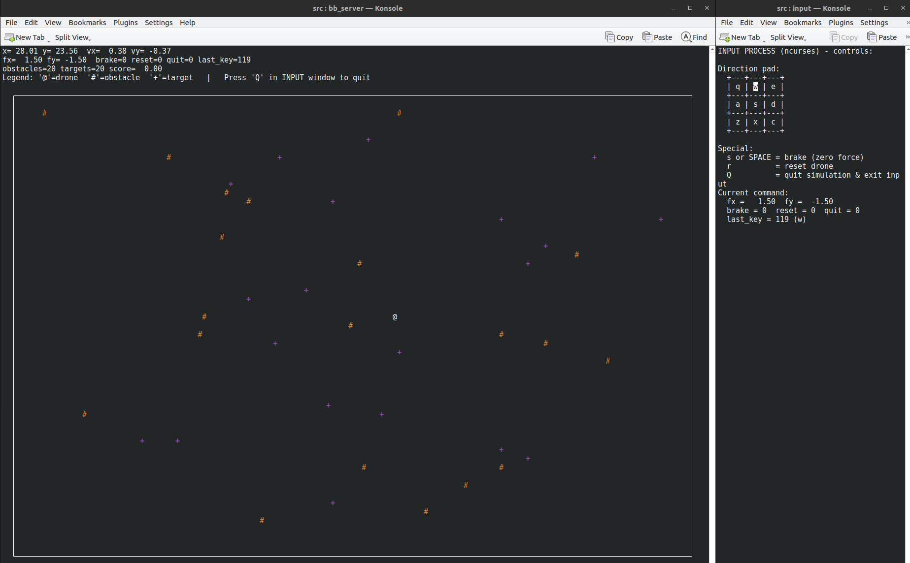

<a id="readme-top"></a>

# Table of Contents
<details>
  <summary>View Dropdown</summary>
  <ol>
    <li><a href="#posix-drone-simulator---assignment-1">POSIX Drone Simulator – Assignment 1</a></li>
    <li><a href="#posix-drone-simulator-in-action">POSIX Drone Simulator in action</a></li>
    <li><a href="#beloved-contributors">Beloved Contributors</a></li>
    <li><a href="#detailed-description">Detailed Description</a>
      <ul>
        <li><a href="#how-to-build-and-run">How to build and run</a>
          <ul>
            <li><a href="#prerequisites">Prerequisites</a></li>
            <li><a href="#build">Build</a></li>
          </ul>
        </li>
        <li><a href="#how-does-it-work">How does it work</a>
          <ul>
            <li><a href="#architecture">Architecture</a></li>
            <li><a href="#active-components">Active components</a></li>
            <li><a href="#masterc">master.c</a></li>
            <li><a href="#bb-server">bb_server</a></li>
            <li><a href="#drone">drone</a></li>
            <li><a href="#input">input</a></li>
            <li><a href="#obstacles">obstacles</a></li>
            <li><a href="#targets">targets</a></li>
            <li><a href="#controls">Controls</a></li>
            <li><a href="#simulation-model-and-logic">Simulation model and logic</a></li>
            <li><a href="#drone-dynamics">Drone dynamics</a></li>
            <li><a href="#user-commands-and-force-mapping">User commands and force mapping</a></li>
            <li><a href="#environment--obstacles-and-targets">Environment: obstacles and targets</a></li>
            <li><a href="#potential-field-repulsion">Potential-field repulsion</a></li>
            <li><a href="#target-scoring">Target scoring</a></li>
            <li><a href="#configuration-file">Configuration file</a></li>
          </ul>
        </li>
        <li><a href="#project-architecture">Project Architecture</a></li>
        <li><a href="#git-history-and-evolution">Git history and evolution</a>
          <ul>
            <li><a href="#phase-1">Phase 1</a></li>
            <li><a href="#phase-migration">Phase Migration</a></li>
            <li><a href="#phase-migration-2">Phase_Migration_2</a></li>
            <li><a href="#phase-3">Phase 3</a></li>
            <li><a href="#phase-extra">Phase Extra</a></li>
          </ul>
        </li>
      </ul>
    </li>
  </ol>
</details>
<br>

# POSIX Drone Simulator - Assignment 1

This repository contains the implementation for the first ARP course assignment: a `multi-process` drone game simulator utilizing `POSIX IPC` and the `ncurses` library. The key idea of this project is controlling the drone which is a **2D point mass** with inertia and viscous damping.To do so, multiple **independent processes** cooperate via **anonymous pipes** and the detailed implementation will be covered down below. 

# POSIX Drone Simulator in action 

[Video Demo](https://www.youtube.com/@renatozaccaria/videos?app=desktop&view=0&sort=dd&shelf_id=0)



# Beloved Contributors

<a href="https://github.com/Cb-dotcom/posix-drone-sim/graphs/contributors">
  
</a>
<br>
<br>

# Detailed Description

## How to build and run

### Prerequisites

- POSIX system (Linux recommended).
- C toolchain (`gcc` or compatible).
- **CMake** ≥ 3.x.
- **ncurses** development libraries.
- **Konsole** terminal emulator (or adjust `master.c` / `run.sh` to your terminal of choice).
- **mpg123** (optional but recommended) for background music and sound effects.

### Build

From the project root:

```
./run.sh 
```

## How does it work

### Architecture

At runtime, the simulator consists of:

- one orchestrator process: `master.c`
- one blackboard and UI process: `bb_server.c`
- four worker processes: `drone.c`, `input.c`, `obstacles.c`, `targets.c`

All inter-process communication uses anonymous pipes created by `master.c`.

The pipes carry:

- `CommandState`: user forces and control flags
- `DroneState`: position and velocity
- `Obstacle[]`: snapshot of all obstacles
- `Target[]`: snapshot of all targets

`bb_server.c` is the central blackboard:

- collects information from all other processes
- computes environment forces from walls and obstacles
- handles scoring and target respawn
- sends final commands to the drone
- renders everything using `ncurses`

### Active components

The active components of this project are:

- `master.c`
- `bb_server.c`
- `drone.c`
- `input.c`
- `obstacles.c`
- `targets.c`

All of them load the same runtime parameters from `bin/conf/drone_parameters.conf` and log to their own file in `bin/log/`.

### master.c

Role:

- entry point of the system
- creates all anonymous pipes:
    - `pipe_drone_cmd` (bb_server to drone)
    - `pipe_drone_state` (drone to bb_server)
    - `pipe_input_cmd` (input to bb_server)
    - `pipe_obstacles` (obstacles to bb_server)
    - `pipe_targets` (targets to bb_server)
- spawns:
    - `bb_server` in a dedicated terminal window
    - `input` in a dedicated terminal window
    - `drone`, `obstacles`, `targets` in the background
- closes all unused pipe ends and waits for children to exit

### bb_server

Role:

- owns the authoritative world state:
    - `DroneState`
    - current `CommandState`
    - arrays of obstacles and targets
    - score and UI related data
- central blackboard and UI:
    - receives:
        - `CommandState` from `input`
        - `DroneState` from `drone`
        - `Obstacle[]` from `obstacles`
        - `Target[]` from `targets`
    - computes environment forces from walls and obstacles
    - handles hits on targets and scoring
    - renders the map, legend and score using `ncurses`
- audio:
    - plays looping background music via `mpg123` in a detached child process

### drone

Role:

- simulates the drone as a 2D point mass with damping
- receives `CommandState` from `bb_server` (user forces combined with repulsion)
- integrates dynamics and enforces:
    - world bounds
    - deadzone on small velocities to remove jitter
- sends updated `DroneState` to `bb_server`

### input

Role:

- `ncurses` control pad for the user
- maps key presses to forces and control flags:
  - directional forces 
  - brake, reset, quit
  - maintains a local `CommandState` (`fx`, `fy`, flags)
  - sends `CommandState` to `bb_server` via a pipe
  - plays sound effects for press, stop, reset, scroll and select actions

### obstacles

Role:

- maintains a dynamic set of obstacles in the world
- respects:
    - `max_obstacles`   
    - `initial_obstacles`
    - `obstacle_spawn_interval` in seconds
- at startup:
    - generates `initial_obstacles` random obstacles
- periodically:
    - activates a new obstacle while under the cap, or replaces the oldest
    - sends the full `Obstacle[]` array to `bb_server`

### targets

Role:

- maintains a dynamic set of targets in the world
- respects:
    - `max_targets` (hard cap)
    - `initial_targets`
    - `target_spawn_interval` in seconds
- at startup:
    - generates `initial_targets` random targets
- periodically:
    - activates or replaces a target at a random position
    - sends the full `Target[]` array to `bb_server`

    
### Controls

Controls live in the `INPUT` window.

Directional forces:

```
+-+-+---+---+        
| q | w | e |        
+---+---+---+        
| a | s | d |  
+---+---+---+
| z | x | c |
+-+-+---+---+
```

Special keys:

- `s` or `SPACE`: brake, zero all forces
- `r`: reset drone position to the world center
- `Q`: quit, propagated to the rest of the system

Each key press:

- updates the local `CommandState`
- plays a sound effect (press, stop, reset, target, scroll, select)
- sends the updated `CommandState` to `bb_server` via the pipe

---

### Simulation model and logic

### Drone dynamics

The drone is modeled as a 2D point mass with linear damping:

$$\sum F = M \ddot{p} + K \dot{p}$$

$$p = (x, y)$$

$$\dot{p} = (v_x, v_y)$$

where:

- `p` is the position
- `dot{p}` is the velocity
- `M` is the mass
- `K` is the damping coefficient

`drone.c` integrates this system with explicit Euler. 

- world bounds are

[0,world_width]×[0,world_height][0, \text{world\_width}] \times [0, \text{world\_height}]

[0,world_width]×[0,world_height]

- when hitting a wall:
    - position is clamped
    - the velocity component pointing into the wall is set to zero
- very small velocities are forced to zero to avoid visual jitter

### User commands and force mapping

`input.c` uses `ncurses` and maps keys to forces.

Parameters from the configuration file:

- `force_step`: per key press increment
- `max_force`: clamp on each force component

On each directional key press:

- `fx` and `fy` are incremented or decremented
- values are clamped to the interval

[−max_force,max_force][-\text{max\_force}, \text{max\_force}]

[−max_force,max_force]

- `last_key` is updated
- the new `CommandState` is sent to `bb_server`

Special keys:

- `s` or `SPACE`:
    - `brake = 1`
    - forces are set to zero
- `r`:
    - `reset = 1`, one shot flag
    - forces are set to zero
- `Q`:
    - `quit = 1`
    - the input process terminates

### Environment: obstacles and targets

Two processes control the environment.

`obstacles`:

- manages up to `max_obstacles`
- starts with `initial_obstacles`
- every `obstacle_spawn_interval` seconds:
    - activates a new obstacle or replaces the oldest one
    - sends the whole `Obstacle[]` snapshot to `bb_server`

`targets`:

- manages up to `max_targets`
- starts with `initial_targets`
- every `target_spawn_interval` seconds:
    - activates or replaces a target at a random position
    - sends the whole `Target[]` snapshot to `bb_server`

`bb_server` receives these arrays via pipes, counts active entries and renders them on the map:

- obstacles as `#`
- targets as `+`

### Potential-field repulsion

Repulsion is implemented in `bb_server.c` and controlled by the parameters:

- `rho`: perception distance, radius of influence
- `eta`: repulsion gain

$$
F_{\text{rep}}(d) =
\begin{cases}
\eta \left( \dfrac{1}{d} - \dfrac{1}{\rho_0} \right) \dfrac{1}{d^2} \lVert v \rVert, & 0 < d \le \rho_0 \\
0, & \text{otherwise}
\end{cases}
$$

where:

- `d` is the distance from the drone to the wall or obstacle
- `rho_0` is:
    - `rho` for walls
    - `rho_obs` for obstacles, defined as

ρobs=1.5 ρ\rho_{\text{obs}} = 1.5 \, \rho

ρobs=1.5ρ

- `eta` is the repulsion gain
- `v` is the velocity of the drone and `\lVert v \rVert` is its magnitude

Repulsion contributions:

- walls:
    - active within distance `rho` of the borders
    - direction:
        - left wall pushes in positive x direction
        - right wall pushes in negative x direction
        - bottom wall pushes in positive y direction
        - top wall pushes in negative y direction
- obstacles:
    - active within distance `rho_obs`
    - direction from the obstacle center to the drone, that is away from the obstacle

If `rho <= 0` or `eta <= 0`, repulsion is disabled and `bb_server` forwards the raw user commands to the drone.

### Target scoring

`bb_server` performs hit detection and scoring:

- keeps the previous drone position `(prev_x, prev_y)` each time a new `DroneState` is received
- for each active target:
    - treats drone motion as a segment from `(prev_x, prev_y)` to `(x, y)`
    - checks for segment and circle intersection with a small hit radius
- when a hit is detected:
    - plays the target sound
    - increments `world.score`
    - respawns that target at a new random location, still active

If the drone moved very little, the squared length of the segment is below a small threshold and hit detection for that frame is skipped to avoid spurious hits.

The score is displayed in the main UI header.

---

### Configuration file

The configuration file is located at `bin/conf/drone_parameters.conf` 

• each process independently calls:
```
sim_params_load(NULL);
const SimParams *params = sim_params_get();
```

• if the file cannot be opened, built in defaults from sim_const.h are used and a warning is logged


## Project Architecture 
```
├── bin
│   ├── conf
│   │   ├── drone_parameters.conf
│   │   ├── music.mp3
│   │   ├── press.mp3
│   │   ├── reset.mp3
│   │   ├── scroll.mp3
│   │   ├── select.mp3
│   │   ├── stop.mp3
│   │   └── target.mp3
│   └── log
│       ├── .gitkeep
│       ├── bb_server.log
│       ├── drone.log
│       ├── input.log
│       ├── obstacles.log
│       └── targets.log
├── build
├── files
│   └── assignmentsv4.1.pdf
├── headers
│   ├── CMakeLists.txt
│   ├── sim_const.h
│   ├── sim_ipc.h
│   ├── sim_log.h
│   ├── sim_params.h
│   ├── sim_types.h
│   └── sim_ui.h
├── src
│   ├── bb_server.c
│   ├── CMakeLists.txt
│   ├── drone.c
│   ├── input.c
│   ├── master.c
│   ├── obstacles.c
│   ├── sim_ipc.c
│   ├── sim_log.c
│   ├── sim_params.c
│   ├── sim_ui.c
│   └── targets.c
├── .gitignore
├── .gitkeep
├── CMakeLists.txt
├── LICENSE
├── README.md
└── run.sh
```

## Git history and evolution

The project was developed in several phases. Each phase corresponds to a specific commit that you can easily check out.

### Phase 1

Goal: set up everything with a good architecture from the start, reusing the file layout already planned for assignment 1.  
This phase has:

- shared memory for communication
- `ncurses` used by both `input` and `bb_server`
- resizable window and main menu
- drone that moves according to physics and user commands
- basic full project to validate the logic

Checkout command:

```bash
git checkout f6fa42f60ef90be39ab9ee3a31cc151a09b91e63
```

### Phase Migration

Goal: move the working design from shared memory to named pipes while keeping the same logical complexity.

This phase:

- replaces shared memory with named pipes
- wires `bb_server`, `input` and `drone` through FIFOs with `select()`
- switches to `konsole` for separate windows

Checkout command:

```bash
git checkout 77648a1cb12b59886fa7446f9a6f5bcb470e78c7

```

### Phase_Migration_2

Goal: move from named pipes to unnamed pipes, which is the final IPC target of the assignment.

This phase:

- uses anonymous pipes created by `master`
- passes file descriptors through `argv`
- keeps environment simple
    - wall repulsion is just setting velocity to zero when the drone is close to a wall
    - obstacles and targets are static placeholders without complete logic

Checkout command:

```bash
git checkout 15c35e26786ff43c76be9e300648c4172bf85b80

```

### Phase 3

Goal: implement the complete final behavior on top of the unnamed pipe architecture.

This phase adds:

- configuration file logic and safety net
- log files for each process
- proper dynamic generation of obstacles and targets
- force based repulsion for walls and obstacles
- full score logic
- UI fixes and legend updates

Checkout command:

```bash
git checkout d12c06c23dd9416333bee40239a1b2dd83d99fdb

```

### Phase Extra

Phase Extra is the polishing phase. Here you are already on the most up to date version of the project.

This includes:

- bug fixes
- music and sound effects
- workflow updates
- final README and documentation

Checkout command:

```bash
git checkout nowhere :). If you are reading this it means you are at the most updated version of our project.
```
